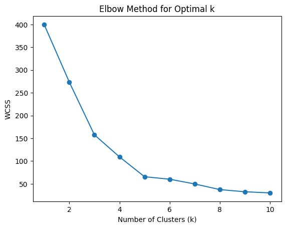
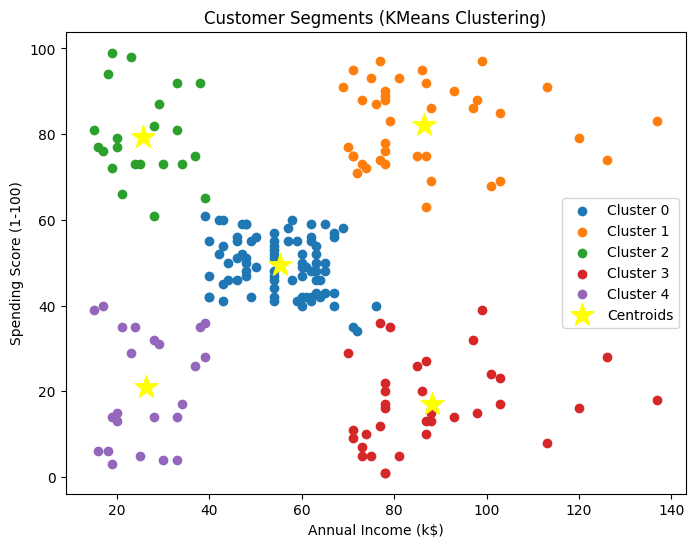

#  Task 8 – Customer Segmentation using K-Means Clustering

#  Objective
The goal of this task is to apply **K-Means Clustering** on a shopping mall dataset to segment customers based on their **Annual Income** and **Spending Score**, helping businesses identify key customer groups and target them effectively.

# Dataset
- **File:** `Mall_Customers.csv`
- **Rows:** 200
- **Columns:** 5
  - `CustomerID` → Unique ID of each customer  
  - `Gender` → Male/Female  
  - `Age` → Age of customer  
  - `Annual Income (k$)` → Annual income in thousand dollars  
  - `Spending Score (1-100)` → Score assigned based on spending behavior  

# Steps Performed
1. **Data Exploration**
   - Checked dataset shape `(200, 5)`
   - Verified no missing values
   - Analyzed numerical distributions and gender ratio  

2. **Feature Selection**
   - Chose **Annual Income (k$)** and **Spending Score (1-100)** for clustering.  

3. **Feature Scaling**
   - Applied `StandardScaler` to normalize the selected features.  

4. **Elbow Method**
   - Computed Within-Cluster Sum of Squares (WCSS) for `k=1 to 10`.
   - Optimal number of clusters found = **5**.  

   

5. **K-Means Clustering**
   - Applied `KMeans(n_clusters=5, random_state=42)`.
   - Assigned each customer to one of 5 clusters.  

6. **Visualization**
   - Plotted clusters with centroids for interpretation.  

   

# Results – Customer Segments
- **Cluster 0 (Blue)** – Average income, average spending → Steady customers  
- **Cluster 1 (Orange)** – High income, high spending → **Premium/VIP customers 💎**  
- **Cluster 2 (Green)** – Low income, high spending → Impulsive buyers  
- **Cluster 3 (Red)** – High income, low spending → Potential customers (need offers)  
- **Cluster 4 (Purple)** – Low income, low spending → Least profitable segment  

# Conclusion
- Using **K-Means**, customers were grouped into **5 segments**.  
- These insights help businesses to:  
  - Focus marketing on **high-value customers (Cluster 1)**  
  - Retain **steady buyers (Cluster 0)**  
  - Convert **wealthy but low spenders (Cluster 3)**  

This segmentation can be applied in **marketing, sales strategy, and customer relationship management (CRM)**.  
